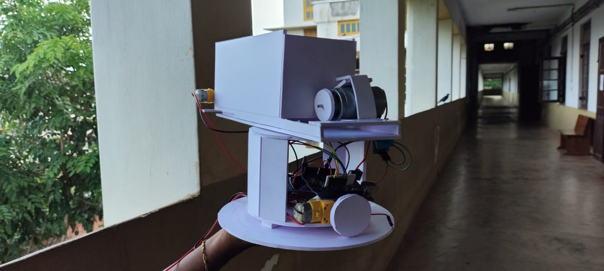
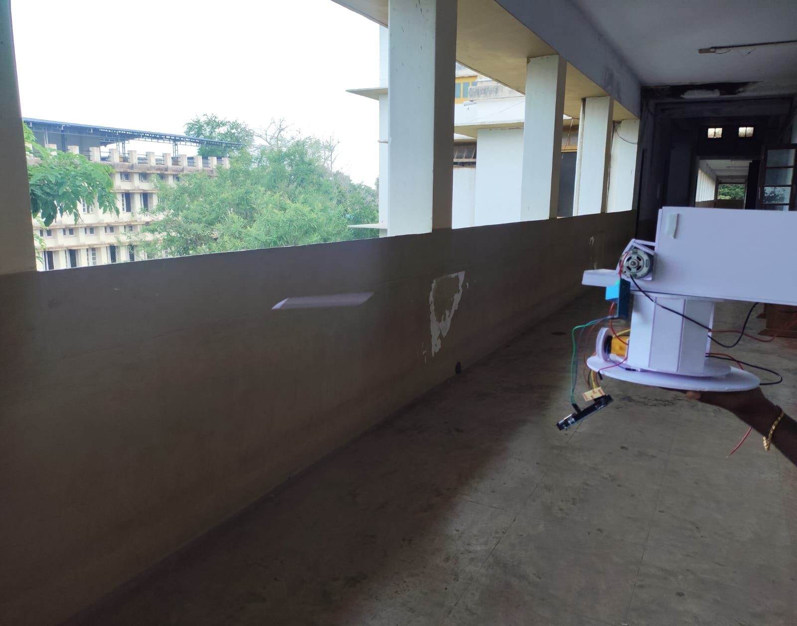

# 🥿 Asian Mom Bot  
*The disciplinary bot you never knew you needed… but your mom always wanted.*  

---

## 📖 Overview  
**Asian Mom Bot** is a computer vision–powered, roast-delivering, chappal-launching demonstration project created for **Useless Projects** hosted by **TinkerHub**.  

Armed with cameras, motors, and a strong sense of justice, this bot detects when:  
- You’re holding a **phone** 📱 when you should be working/studying.  
- You’re looking **sleepy** 😴 when you should be alert.  

Once it has you in sight, it:  
1. Locks onto you like a budget version of Iron Man’s targeting system.  
2. Plays a randomized *Asian mom roast* through speakers.  
3. Fires a **safe, custom-made demonstration chappal** at your torso.  

*(No heads were harmed in the making of this bot — safety first, shame second.)*  

---

## 📸 Project Images  

**The Bot in Action:**  
  
  

---

## 🎥 Demo Video  
Watch the bot in action here:  
[](https://www.youtube.com/watch?v=_lgAQ1pNlEk)

---

## 🎯 Key Features  
- **Real-time Computer Vision**  
  - Detects *phones* and *sleepy faces* using YOLOv5 and Mediapipe.  

- **Target Lock & Track**  
  - Once you’re marked, the bot pivots to keep you in the line of fire — even if you try to sneak away.  

- **Safe Chappal Delivery System™**  
  - **Custom-made soft demo chappals** — *non-lethal and safe for indoor use*.  
  - **Pivot + geared motors** for aiming.  
  - **Stackable loader** for multiple shots.  
  - **Gearless projection motor** for a comedic but non-dangerous launch.  

- **Authentic Roast Audio** 🔊  
  - Plays randomized audio insults in the style of an Asian mom.  
  - Triggered automatically on detection — even without a launch.  

---

## 🛠 How It Works  

1. **Detection Phase** 👀  
   - CV checks for phone usage or signs of drowsiness.  

2. **Tracking Phase** 🎯  
   - Motors pivot the launcher toward the target’s torso.  

3. **Engagement Phase** 🥿💨  
   - Audio roast plays.  
   - Demo chappal is launched at torso height.  

---

## 🚀 Getting Started  

### Prerequisites  
- Python 3.8+  
- PyTorch + YOLOv5 dependencies  
- Mediapipe  
- Arduino IDE  
- Custom demo chappals 🥿 (lightweight, soft material)  

### Setup  
1. Clone the repo:  
   ```bash
   git clone https://github.com/yourusername/AsianMomBot.git
   cd AsianMomBot

2. Install dependencies:

   ```bash
   pip install -r requirements.txt
   
3. Upload Arduino control code to your board.

4. Run the CV detection script:

   ```bash
   python asian_mom_bot.py

---

## ⚠️ Safety Notes
- The chappal is custom-made for demonstration using lightweight, soft materials.
- Launcher is aimed at the torso only — no headshots allowed.
- Keep a safe distance when testing.
- This project is meant for fun and education only.

## 🏆 Credits
Created for Useless Projects by TinkerHub.
Inspired by the legendary accuracy and unrelenting discipline of Asian moms worldwide — but made safe for public demos.
